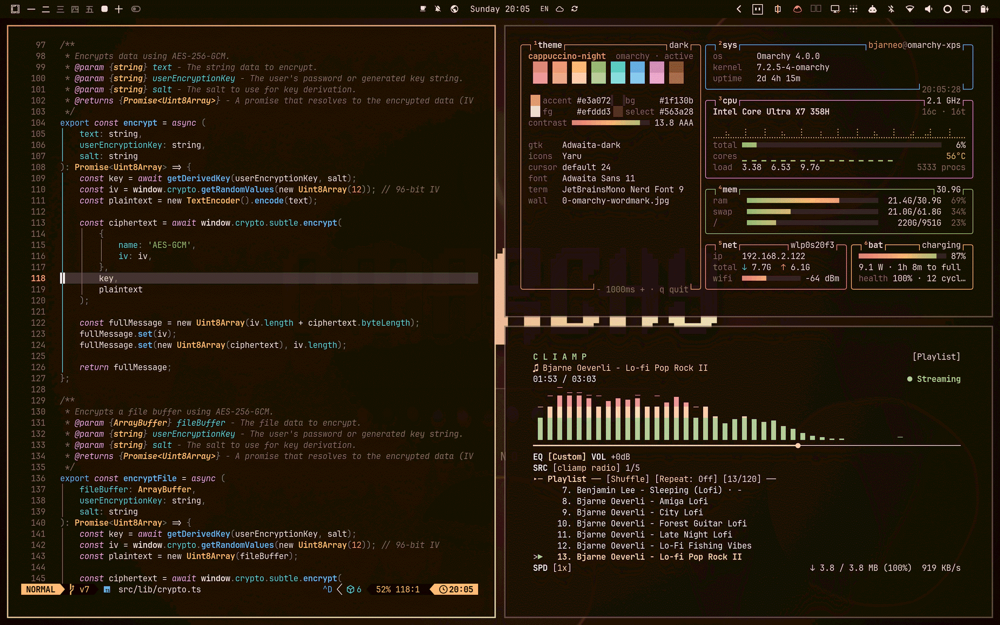

# ☕ Cappuccino Night

An aesthetic, cozy, and ultra-refined coffee dark theme for Omarchy Linux and Hyprland. Inspired by the rich warmth of freshly brewed espresso, velvety crema, and steamed latte foam, styled with Velvet Dusk's signature whisper gradient borders and borderless transparency.



## ✨ Features

- **Whisper Window Borders**: Feather-light 1px 45° gradient transitioning from glowing warm **Amber Cappuccino** (`rgba(e3a07255)`) to soft **Crema Foam** (`rgba(e7d6b338)`), with a seamless borderless transparent inactive frame (`rgba(00000000)`).
- **Dynamic Window Styling**: Clean tiling geometry (`rounding = 6`, `gaps = 1`) paired with rounded floating windows (`rounding = 10` for dialogs, modals, and pickers).
- **Deep Espresso Obsidian**: `#1f130b` rich roasted coffee base with warm undertones, dark mantle (`#170e08`), and translucent shell bar (`0.92` alpha).
- **Warm Latte Typography**: Soothing creamy foreground (`#efddd3`) and bright foam highlights (`#fdf5f1`) engineered for zero eye strain during late-night hacking sessions.
- **Themed Groupbar Tabs**: Native styling for Hyprland window groups with Cappuccino active tabs, roasted espresso inactive tabs, and Inter typography.
- **Complete App Coverage**: Themed Hyprland, Quickshell, hyprlock, Ghostty, Kitty, Alacritty, and Foot terminals.
- **Curated High-Res Media**: Handpicked warm coffee and barista backgrounds, including dynamic video wallpaper (`backgrounds/5-steam.mp4`).

## 🎨 Palette

| Role | Color | Hex |
| :--- | :--- | :--- |
| **Background** | Roasted Espresso | `#1f130b` |
| **Dark Background** | Dark Roast Mantle | `#170e08` |
| **Darker Background** | Midnight Bean Crust | `#100a06` |
| **Surface** | Warm Coffee Bean | `#302118` |
| **Selection** | Deep Mocha Slate | `#563a28` |
| **Foreground** | Creamy Steamed Foam | `#efddd3` |
| **Muted Text** | Warm Cocoa Muted | `#856e60` |
| **Primary Accent** | Warm Cappuccino Amber | `#e3a072` |
| **Active Border** | Amber ➔ Crema Foam (45°) | `rgba(e3a07255)` ➔ `rgba(e7d6b338)` |
| **Inactive Border** | Transparent | `rgba(00000000)` |

### ANSI Colors

- **Normal**: `Black #302118` | `Red #e4877b` | `Green #9dbe79` | `Yellow #fcb774` | `Blue #6eb4e1` | `Magenta #d990be` | `Cyan #63cbc7` | `White #efddd3`
- **Bright**: `Black #856e60` | `Red #f1a398` | `Green #b6d39a` | `Yellow #fdd6b2` | `Blue #91c9ef` | `Magenta #e9abd1` | `Cyan #8edfdb` | `White #fdf5f1`

## 🖼️ Curated Wallpapers

Curated backgrounds included in `backgrounds/`:

1. `0-omarchy-wordmark.jpg` — Omarchy minimalist coffee wordmark
2. `1-latte-art.jpg` — Artisanal latte art pour
3. `2-recipe.jpg` — Minimalist brew ratio chalkboard recipe
4. `3-crema-swirl.jpg` — Espresso crema swirl in macro view
5. `4-coffee-beans.jpg` — Dark roasted coffee beans macro texture
6. `5-steam.mp4` — Dynamic ambient rising steam loop

Cycle wallpapers with:
```bash
omarchy theme bg next
```

## 🚀 Installation & Activation

### Using Omarchy

```bash
omarchy theme install https://github.com/m7sh/cappuccino-night-theme.git
```

### Manual Installation

Clone into your themes directory:
```bash
git clone https://github.com/m7sh/cappuccino-night-theme.git ~/.config/omarchy/themes/cappuccino-night
omarchy theme set "Cappuccino Night"
```

Restart running terminals or the shell to immediately apply changes:
```bash
omarchy restart terminal
omarchy restart shell
```
